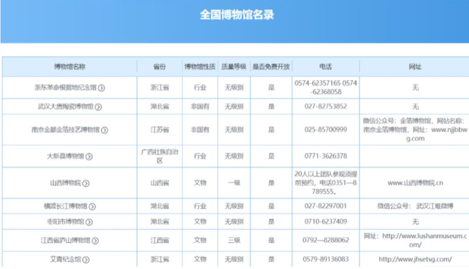
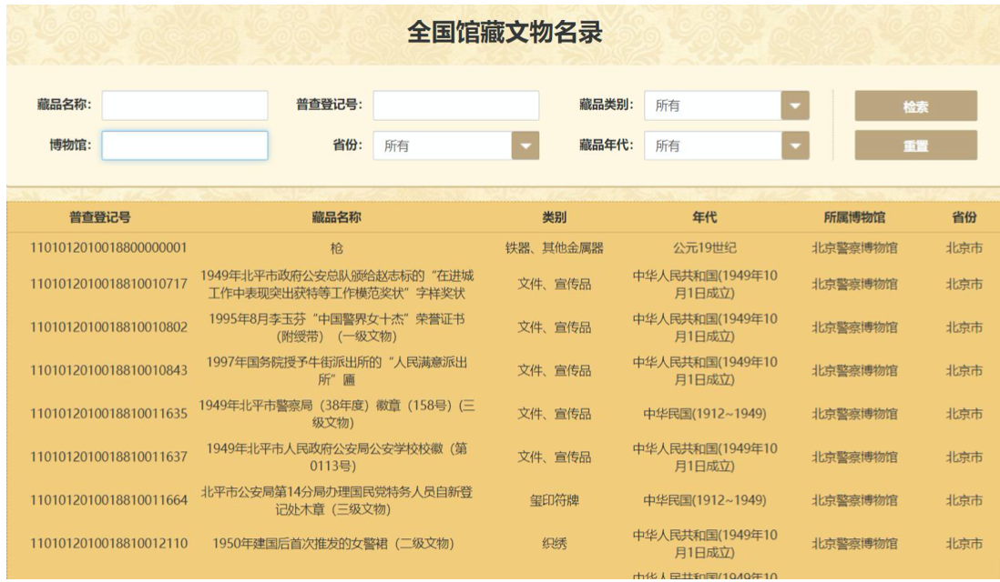
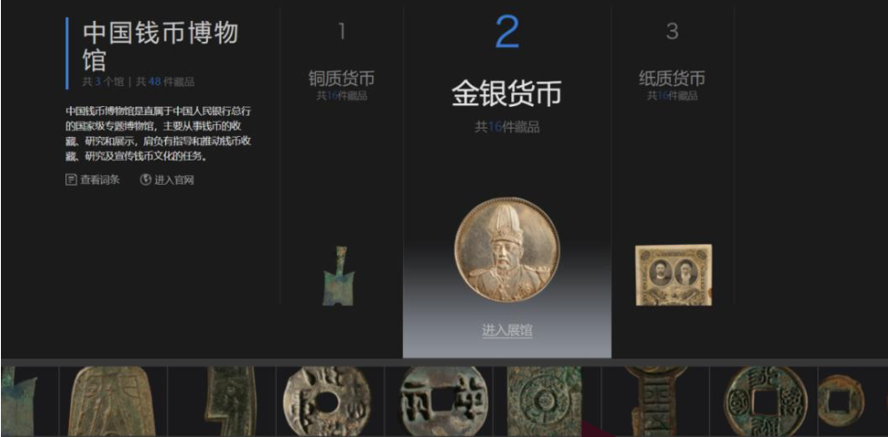

# README

该系统的目的是建立全国博物馆的空间数据库，旨在为公众提供全国各地 博物馆的信息查询与空间分析功能以及为博物馆研究人员提供较为完善的数据 分析查询平台支持。系统主要任务如下:

1. 收集整理全国博物馆基本信息及其地理空间信息   
2. 收集整理博物馆馆藏文物信息
3. 收集整理全国基础地理数据（行政区划及道路、水系要素等）

## 系统功能
系统支持如下功能：
1. 博物馆信息查询功能
如查询某地的博物馆分布情况、查询博物馆信息、查询各类型博物馆藏品的空间分布情况等

2. 博物馆空间分析功能
如区域博物馆分布密度分析、查询某一位置点一定缓冲区内的博物馆情况、博物馆旅游规划功能等

## 附：现有系统调研

1. 国家文物行政管理平台

(1) 平台简介

国家文物局综合行政管理平台是国家文物局建设的文物综合管理平台，其 主要负责国家文物和博物馆信息的统计管理，整理的信息用作公共信息服务用 途。目前，其网站平台整理了全国博物馆的基本信息，并按世界遗产、重点文 物 保护单位、历史文化名城、名镇、名村、历史文化街区等分类整理了现有国内的文化旅游资源。

(2) 数据收录情况
该平台的全国博物馆名录栏目共收录了全国 5164 个博物馆，对其所处位置的精确到省，并对博物馆性质、质量等级、是否免费、开放时间、交通信息、 联系电话、网址的情况进行了收录，数据情况如:

(3) 平台功能及其不足

目前，该平台所提供的博物馆信息查询功能只是基础的信息查询，地理信 息只涉及博物馆所在省份，实际应用时只能按照博物馆名字进行查询，也没有 空间查询和空间分析功能。用户若需要查询某一个省份有哪些博物馆、其实际 地理分布情况如何等信息，还需要通过其他多个平台的信息综合而成。

2. 全国馆藏文物名录

(1) 平台简介

全国馆藏文物目录是国家文物局为推动文物信息资源共享，促进文物保护和利用工作所搭建的全国博物馆馆藏文物信息展示平台，意在全面深入推进可 移动文物信息公开共享，创造条件方便公众查询、研究和利用，接受群众监 督，逐步扩大公开共享范围。公布的信息从第一次全国可移动文物普查登录的 珍贵文物信息中提取，覆盖全国 31 个省、自治区、直辖市的国有博物馆，内容 包括文物名称、年代、类别、收藏单位、普查登记号等，并提供各项指标的查 询、检索功能，方便社会公众研究和利用。

(2) 数据收录情况

公布的信息从第一次全国可移动文物普查登录的珍贵文物信息中提取，覆 盖全国 31 个省、自治区、直辖市的国有博物馆，内容包括文物名称、年代、类 别、收藏单位、普查登记号等，并提供各项指标的查询、检索功能，方便社会 公众研究和利用。从已公开的目录来看，故宫博物院有 2800 余条、国家博物馆 有 3500 余条、上海博物馆有 94000 余条、首都博物馆有 58000 余条、陕西历史 博物馆有 16000 余条、南京博物院有 11000 余条，所有博物馆的公开的藏品记 录共两百多万条。

(3) 平台功能及其不足

目前系统支持按照藏品名称、普查登记号、藏品类别、博物馆、省份、藏 品年代查询文物信息，即其数据库中已有基本的统计建设，只是相对百度博物 馆而言缺乏生动的语音和图片介绍，且没有提供关于博物馆和文物的空间查询 功能，需要进一步完善。

3. 百度数字博物馆

(1) 平台简介

该平台为百度百科的大型公益科普项目，将实体博物馆搬到网上，通过音 频讲解、实境模拟、立体展现等多种方式让用户通过互联网即可观赏各类珍贵 展品，减少了大众获取知识的门槛，足不出户逛博物馆。

(2) 数据收录情况

目前加盟百度数字博物馆计划的博物馆有 1681 家，其中展览厅上线的博物 馆为 285 家，均为规模较大的博物馆，对于规模较小的博物馆仅以百度百科词 条的方式进行介绍。
对于上线博物馆而言，目前平台所整理并公开展示的数据有:博物馆简 介、博物馆展厅、藏品介绍等信息，用户可以按照关键字检索存在的博物馆，也可以查看某地具有哪些博物馆，还可以 看到百度百科定期的博物馆推荐页。

(3) 平台总结及不足

总体来说，目前该平台的建设还存在上线博物馆较少的不足，也没有博物 馆的精确位置，在博物馆分布视图中只精确到省份的尺度，但部分上线博物馆 的信息都比较丰富，拥有详细说明的博物馆信息比较丰富、美观。

4. 中国国家博物馆

(1) 平台简介

中国国家博物馆的前身可追溯至 1912 年成立的国立历史博物馆筹备处， 2003 年根据中央决定，中国历史博物馆和中国革命博物馆合并组建成为中国国 家博物馆。2007 年，中国国家博物馆启动改扩建工程，2011 年 3 月新馆建成开 放，其建设目标是为国家博物馆的学术研究、陈列展览、教育宣传和文创开发 提供了有力的保障和支持。

(2) 数据收录情况

计划分多期收录馆藏文物，目前仅有一期，按照其网站描述的收录内容 为:“藏品数据 251523 条，306447 件。其中包括古代藏品数据 198110 条， 200272 件藏品，含瓷器、钱币、考古发掘品，及文留的铜佛、玉器等;近现代 藏品数据 49163 条，55384 件藏品，含多种近现代历史类、艺术类藏品;图书 藏品数据 4250 条，50791 件藏品，含善本古籍、普通古籍。”

(3) 平台功能及其不足

在目前网站公开的馆藏条例中，仅有简单的藏品名称、年代、普查编号、 图片信息，藏品的更多详情并未披露，也没有为大众提供关于藏品的统计视 图、空间分析等功能。

5. 故宫博物院

(1) 平台介绍

故宫博物院是一座建立在明清两朝皇宫——紫禁城基础上的博物馆，包含 186 万余个的独特藏品，世界上规模最大、保存最完整的木结构宫殿建筑群， 以及记载了明清宫廷历史的种种鲜活档案。作为中国最大的古代文化艺术博物 馆，其文物收藏主要来源于清代宫中旧藏，是第一批全国爱国主义教育示范基地。

(2) 平台建设情况

平台网站包含了经过分类的馆藏目录，用户通过如下图所示界面可以根据 藏品类型进行检索，选定类别之后以表格的形式展示文物信息，包含文物的名 称、所在时代以及编号信息。同时，平台还提供故宫的建筑、古籍目录的检 索，对于建筑提供了建筑名称、所处时代、建筑形式、区域等信息;对于古 籍，根据时代、类型进行了分类，提供了古籍名称、时代、版本等信息，如下图。

(3) 平台总结及不足

平台游览功能相对完善，用户能够获得博物馆内各方面的信息，包括馆藏 内容的介绍与查询，特殊展览咨询以及全景图片游览，但问题仍然是藏品信息 展示较为简单，缺乏基本的统计及分析功能。

## 参考资料
1. [百度博物馆地图](https://baike.baidu.com/museum)
2. [国家文物局综合行政管理平台](http://gl.sach.gov.cn/sachhome/index.html)
3. [全国文物馆藏名录](http://gl.sach.gov.cn/collection-of-cultural-relics/index.html)
4. [中国国家博物馆简介](http://www.chnmuseum.cn/gbgk/gbjj/)
5. 文物博物馆管理中的问题及措施研究 肖仁杰
6. 博物馆藏品的数字化管理 付森
